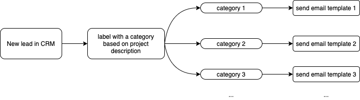

# Proyecto final
## Envíe correos electrónicos personalizados a clientes potenciales con Machine Learning

Proyecto Bootcamp AI MLDN. [Nanodegree de Ingeniero de Aprendizaje Automático] (https://bootcampai.org/aws-ml).

El proyecto trata sobre el uso del aprendizaje automático para enviar un correo electrónico personalizado al cliente potencial según la descripción del proyecto.

  

## [1. Capstone Proposal](https://github.com/suryasanchez/machine-learning-engineer-nanodegree/tree/master/P3-capstone-project/Capstone-Proposal.pdf)

## [2. Capstone Notebook](https://github.com/suryasanchez/machine-learning-engineer-nanodegree/tree/master/P3-capstone-project/Capstone-Notebook.ipynb)

## [3. Capstone Web App](https://github.com/suryasanchez/machine-learning-engineer-nanodegree/tree/master/P3-capstone-project/index.html)

### Environment

 AWS Sagemaker
* kernel: conda_python3

### Summary of the Capstone Notebook
1. Definición

* 1.1 Descripción general del proyecto

* 1.2. Planteamiento del problema

* 1.3 Métricas

2. Análisis

* 2.1 Recopilación de datos
* Configuración de conexión CRM
* Verifique el formato de los datos de la API y explore el contenido
* Crea el conjunto de datos

* 2.2 Preprocesamiento de datos
* Limpiar los datos
* Exportar a CSV para etiquetado
* Importar el CSV etiquetado
* Reducir el número de clases
* Detectar el idioma del texto
* Conserve solo texto en francés
* Tokenización
* Funciones de Bag-of-Words
* Guarde el conjunto de datos de entrenamiento procesado localmente

* 2.3 Entrenamiento y prueba del modelo
* Subiendo los datos de entrenamiento
* Modelo XGBoost
* Probando el modelo

* 2.4 Ajuste de los hiperparámetros
* Sintonizador de hiperparámetros

* 2.5 Clasificación binaria
* Dos categorías
* Entrenamiento del modelo
* Probando el modelo
* Ajuste de los hiperparámetros

* 2.6 Implementar el modelo

* 2.7 Aplicación web
* Prueba de entrada
* AWS Lambda
* Aplicación web HTML

3. Conclusión

* 3.1 Reflexión

* 3.2 Mejora

* 3.3 Aplicación

4. Referencias